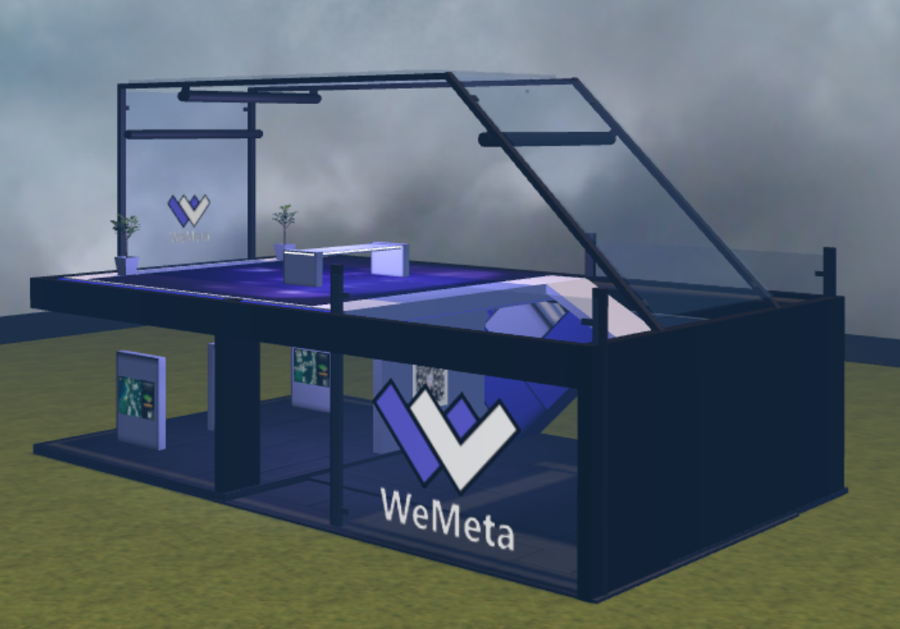

# Which Metaverse should I play?

The quantity and variety of Metaverses is growing enormously month over month. With this growth, it can be overwhelming to filter through and find the right Metaverse for your needs. This article aims to disambiguate the different kinds of Metaverses, as well as provide associated resources for each one.

### Metaverse as a Platform

Certain Metaverses excel as platforms on which land owners and players can build. Sometimes these Metaverses offer only rudimentary geography - instead creating powerful game engines and building & terraforming tools for others to harness. These Metaverses are quite popular as they enable others to craft and shape their own digital visions.&#x20;

| Title                                                                                                                         | Details                                                                                                                                                                                                                                                                                                                                                                                                                                                                                                                                                                                                                                                                                                                                                                                                                                      |
| ----------------------------------------------------------------------------------------------------------------------------- | -------------------------------------------------------------------------------------------------------------------------------------------------------------------------------------------------------------------------------------------------------------------------------------------------------------------------------------------------------------------------------------------------------------------------------------------------------------------------------------------------------------------------------------------------------------------------------------------------------------------------------------------------------------------------------------------------------------------------------------------------------------------------------------------------------------------------------------------- |
| 
<a href="https://docenrtaland.com">Decentraland</a>  
          | 
<a href="https://docenrtaland.com">Decentraland </a>is a decentralized virtual reality platform powered by the Ethereum blockchain. Within the Decentraland platform, users can create, experience, and monetize their content and applications.

Some parcels are further organized into themed communities, or <a href="https://docs.decentraland.org/decentraland/glossary/#district">Districts</a>. The Decentraland community is very activity - frequently throwing <a href="https://events.decentraland.org">large events</a>, partnering with <a href="https://events.decentraland.org/event/?id=746bb7dd-4044-45bd-b87a-b93fcf9ea379">major artists</a>, and hosting <a href="https://nye.wemeta.world">megastructures</a>.   Decentraland is largely a web experience, as opposed to a VR experience. 
 |
| 
<a href="https://www.sandbox.game/en/">The Sandbox</a> 
   | 
<a href="https://www.sandbox.game/en/">The Sandbox</a> is a virtual Metaverse where players can play, build, own, and monetize their virtual experiences. Sandbox empower artists, creators, and players to build the platform they’ve always envisioned, providing them with the means to unleash their creativity.

 The geography of Sandbox is larger than Decentraland, with many parcels owned by high-<a href="https://fortune.com/2021/12/09/snoop-dogg-rapper-metaverse-snoopverse/">profile individuals or celebrities</a>. Unlike other Metaverses in this list, Sandbox is not yet publicly available to play - with Alpha previews being dropped throughout the year.  While the Sandbox is played through a downloadable client, it is unclear if VR will be supported in the near future.  
           |
| 
<a href="https://somniumspace.com">Somnium Space</a>  
 | 
<a href="https://somniumspace.com">Somnium Space</a> is an Open, Social, Virtual Reality world. A world with its own economy and its own currency. A VR world with its own Marketplace, Games, Social experiences and Virtual Land ownership.  Somnium support web, client, and full-VR interfaces, with full-VR recommended for the best experience. Somnium also supports S<a href="https://somniumspace.medium.com/announcing-somnium-worlds-somnium-web-blockchain-avatars-slo-details-prices-81ec741e2d3a">omnium Worlds</a> - player owned Metaverses within the larger Metaverse.   The high technical barrier to play Somnium leaves it with a lower, but very tight-knit, accessible &#x26; passionate player base - frequently building and <a href="https://somniumspace.com/events">throwing events</a>.  
 |

### Metaverse as a Game

Some Metaverses, while still fundamentally platforms, more tightly control what can be owned and built. These Metaverses still offer incredible upsides, though player & owner freedom is more controlled or restricted by the game design of that Metaverse.

| Name                                                                                                                                | Details                                                                                                                                                                                                                                                                                                                                                                                                                                                                                                                                                                                                                                                                                                                                                                                                                                                                                                                                      |
| ----------------------------------------------------------------------------------------------------------------------------------- | -------------------------------------------------------------------------------------------------------------------------------------------------------------------------------------------------------------------------------------------------------------------------------------------------------------------------------------------------------------------------------------------------------------------------------------------------------------------------------------------------------------------------------------------------------------------------------------------------------------------------------------------------------------------------------------------------------------------------------------------------------------------------------------------------------------------------------------------------------------------------------------------------------------------------------------------- |
| 
<a href="https://www.leagueofkingdoms.com">League of Kingdoms</a> 
 | 
<a href="https://www.leagueofkingdoms.com/lok">League of Kingdoms</a> is a full feature MMO Strategy game where gamers can enjoy single (PvE), multi (PvP), or party-play (MMO). Armed with wide-ranging and rich game modes, contents, and events, the game appeals to not just crypto enthusiasts but also mainstream gamers.  Land in League of Kingdoms is used to explicitly drive in-game outcomes - be that the creation of kingdoms, the harvesting of resources, or the consolidation of territory.  
                                                                                                                                                                                                                                                                                                                                                                                                               |
| 
<a href="https://www.highstreet.market">Highstreet</a> 
            | 
<a href="https://www.highstreet.market">Highstreet </a>bridges the physical and digital worlds with a brand new MMORPG. Built natively with Unity and Blockchain technology, Highstreet provides real products with additional utilities by turning them into in-game items.

Highstreet is designed with game mechanics in mind. Earn by taking on roles like Archer and Brawler clearing monsters and protecting cities. With your earnings, you can buy homes across vast regions to help expand your base of operations. Then of course with merchants everywhere in game, upgrade your digital and real identities by purchasing <a href="https://www.highstreet.market/collectibles">phygital products from real brands</a>.

Highstreet has also created an NFT - <a href="https://www.foreverfomoducksquad.com">the FOMO Duck</a>, which will have in-Metaverse uses as Highstreet is built out.  
 |

### Metaverse as a Gallery

Some Metaverses excel at showcasing art work, architecture, and other digital assets. These 'hype' Metaverses are often used to house player-owned NFTs for showcasing to the world at large.&#x20;

| Name                                                                                                                     | Details                                                                                                                                                                                                                        |
| ------------------------------------------------------------------------------------------------------------------------ | ------------------------------------------------------------------------------------------------------------------------------------------------------------------------------------------------------------------------------ |
| 
<a href="https://www.cryptovoxels.com">Cryptovoxels</a> 
 | [Cryptovoxels ](https://www.cryptovoxels.com)is a virtual world and metaverse, powered by the Ethereum blockchain. Players can buy land and build stores and art galleries. Editing tools, avatars and text chat are built in. |

### Pocket Metaverses

Many of the Metaverses listed above are continuous - that is, Land owned by different people exists on the same (mostly) continuous geography of that Metaverse. Pocket Metaverses, by contrast, are still virtual spaces - but they no longer exist on the larger continuous geography of the Metaverse. Animal Crossing Islands, individual Minecraft Servers, and Rec Room games are historical examples of Pocket Metaverses.

|                                                                                                                         |                                                                                                                                                                                                                                                                                                                                                                                                                                                                                                                                                                                                                                                                                                                                                                                                                                                                                                                                                                                              |
| ----------------------------------------------------------------------------------------------------------------------- | -------------------------------------------------------------------------------------------------------------------------------------------------------------------------------------------------------------------------------------------------------------------------------------------------------------------------------------------------------------------------------------------------------------------------------------------------------------------------------------------------------------------------------------------------------------------------------------------------------------------------------------------------------------------------------------------------------------------------------------------------------------------------------------------------------------------------------------------------------------------------------------------------------------------------------------------------------------------------------------------- |
| 
<a href="https://bigtime.gg">Big Time Studios</a> 
      | 
<a href="https://bigtime.gg">Big Time</a> is a multiplayer action RPG where you team up with friends to adventure across time and space. A Time Machine, otherwise known as a Personal Metaverse is a player’s portal to their own pocket universe. You can think of the Time Machine as a starter home to hang out with friends or showcase your NFTs and loot. Every player is given a Time Machine after reaching a certain level, in the early stages of the game.

 <a href="https://medium.com/playbigtime/big-time-space-rarity-utility-explained-331c8de2905">SPACE</a>, Big Time’s version of virtual land, is used as an expansion to your Time Machine. The larger the SPACE, the more capacity it has to install more features. For example, Time Keepers and Forges enable players to earn Tokens as they play.  While SPACE is available for purchase, the Big Time Game has not yet released - with early access slated for some time in early 2022. 
 |
| 
<a href="https://www.niftyisland.com">Nifty Island</a> 
 | 
<a href="https://www.niftyisland.com">Nifty Island</a> is an open social gaming platform and virtual world being developed by Nyft Studios. It will be the centerpiece and first title in the Nyftverse: a set of interoperable games, a marketplace, play-to-earn protocol, game developer tools and infrastructure —all powered by web3 to realize the dream of a truly open and player-owned metaverse.  Every user is greeted with their own island, entirely free, and tasked with building their home in the metaverse. The player is able to build structures, play and create games, import their nft collection, purchase new 3D, metaverse-ready NFTs from our marketplace, earn new items for their island by completing quests, and socialize with other players via voice and text chat.

                                                                                                                                                                    |

